

  

# IMPORTANT TO READ!!

This hud needs 2 Fonts to be installed on your system to properly work

  [Gamefont (Damage Numbers)](https://files.catbox.moe/cxknym.ttf)
  
  [MingLiU-ExtB (Whole UI)](https://files.catbox.moe/is6y9d.ttf)

## Do not use minimal HUD, it breaks most custom things!

# AKEX HUD

 A weird and purple maidcore HUD that I made for me, but I decided to make it public.

 This HUD is a forked and heavily edited version of ToonHUD; I liked the base, but I didn't like the actual basic HUD.
 
 (Is still in BETA)

  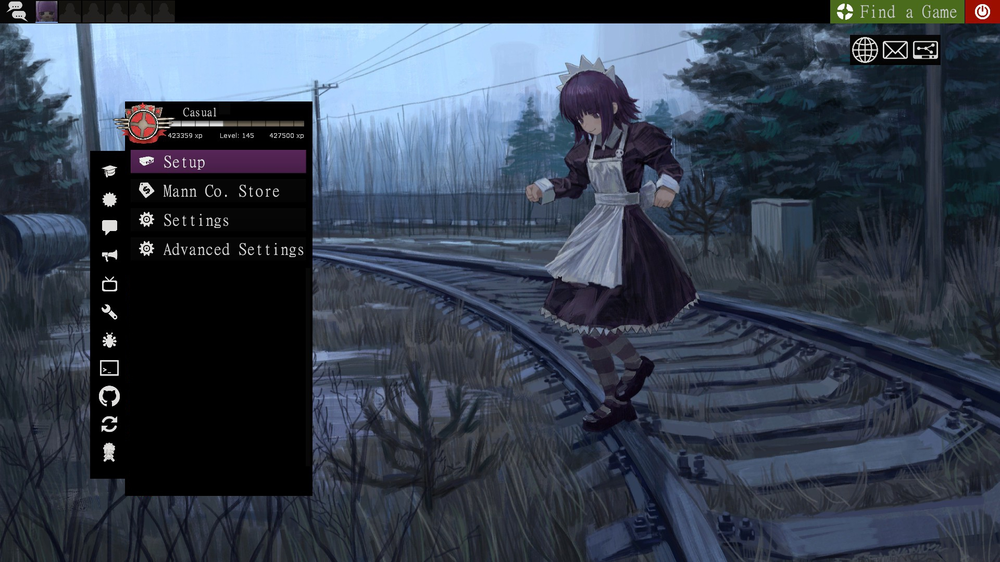

## HUD

> Custom background for different menus

> Heavily edited UI/HUD

> Stats removed (Yes. stats are no more, I mostly remove it for the loading screen) 

> Centered meters (below crosshair) 

> Gameplay mascot (Love it, based of [Niko reactions](https://gamebanana.com/mods/650785))

> I dunno what else to add

## Stuff about the HUD

This HUD was made for 16:9, in 4:3 some stuff might break: I haven't checked resolutions above 1080p so it might break, I dunno

Some stuff are still placeholder since making a HUD takes time, but eh, is not like I'm not gonna leave them like that... right?

There was a very old maidcore HUD that I saw on gamebanana time ago, the HUD had a lot of problems, but I like it the idea, so yeah, the fonts were taken from there

Scout can be really annoying to play sometimes depending on your lodaout, since bars are centered, you might see a lot of them, so keep that in mind

## ADDONS

Yes! this HUD has a few ADDONS that I made for it

Install them with this [Casual Preloader](https://gamebanana.com/tools/19049)

  [Paper Mario Crits](https://drive.google.com/file/d/14JCULTlA0ANvjRzbESd7e5aNIVucFZ3d/view?usp=sharing) (Someone made this in gamebanana already, but I added more things to it, like mini crit and updated the crit particle)

  [Heart Crosshair](https://drive.google.com/file/d/1ZC2Oq_H5GvU6PT1YQbjAXm4cOeWYn2MZ/view?usp=sharing) (remember to set the crosshair to none in multiplayer for custom crosshairs!)
  
  [Yakui Medic Callout](https://drive.google.com/file/d/1M-qv2SLwZjygDf2bdLrgBXM_VmgxRPPs/view?usp=sharing)
  

  

## Recommended Mods

[Dark Light Class Portraits](https://gamebanana.com/mods/648709)

[Class Icons Fixed](https://gamebanana.com/mods/641043)

[Vaporwave Ordinary Days](https://gamebanana.com/sounds/47984)

[Sewerslvt songs](https://gamebanana.com/sounds/73930) or [Library of Ruina Lobby](https://gamebanana.com/sounds/79180) (Both are for the main menu music)

[Persona 5 UI sounds](https://gamebanana.com/sounds/71875)

[Minigun Drum Bullets](https://gamebanana.com/sounds/66626) (Not really a recommendation, I just think it is funny to include it with this HUD)

  ## Art

  The original artwork of the gameplay mascot was made by [Kimispice](https://x.com/kimispice/status/2021289963237568746), I had to draw (yes, draw) more sprites for it to work, but credits to'em for creating the original one

  The menu background was made by [An_Yb](https://www.pixiv.net/en/artworks/142351663)

  The Backpack/Loadout background are edited versions from [Pelcman's artwork](https://pelcman.honifuwa.com/post/613474535371669504/20200324-its-time-to-take-your-happiness-back)

  The loading screen, is literally just a screenshot taken from the video of the 2025 [Chikoi Album](https://www.youtube.com/watch?v=KH89fk-0qks) (A place holder still)

  The chibi Chikoi health icon was made by [Hinemosu Notari](https://danbooru.donmai.us/posts/394495?q=chikoi_%28nijiura_maids%29+)

  

   ## HUD Screenshots

  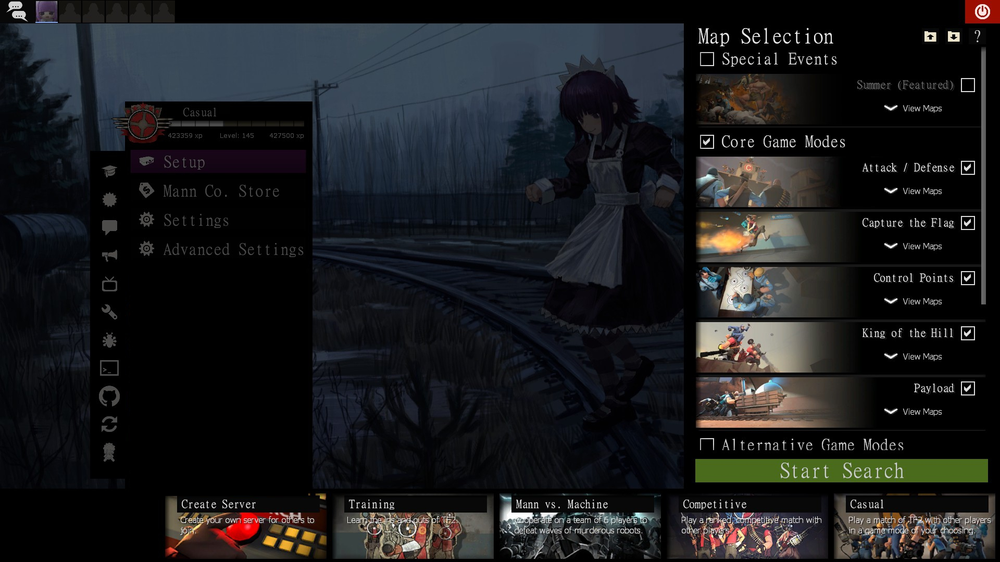

  

  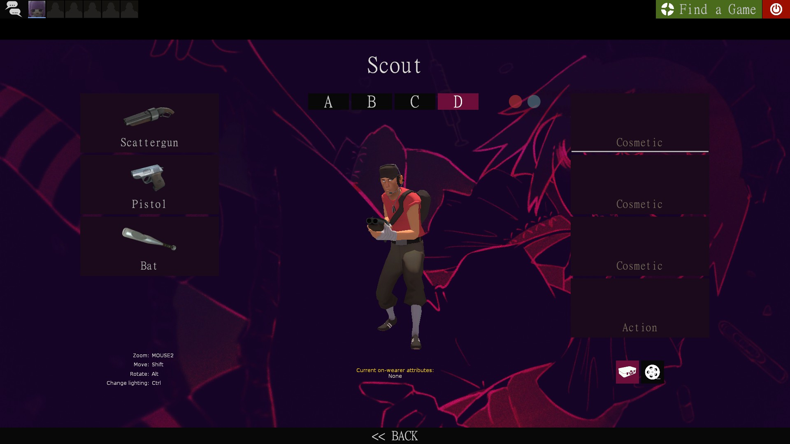

  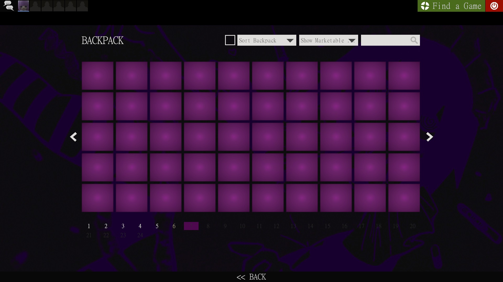

  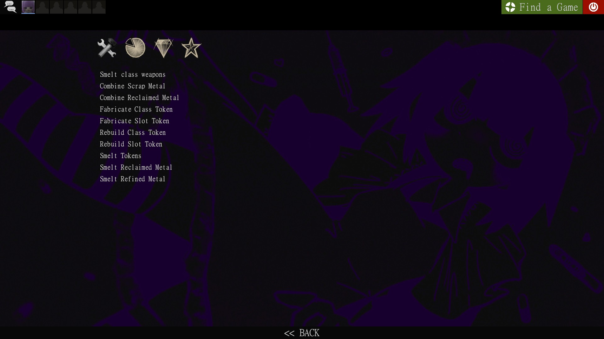

  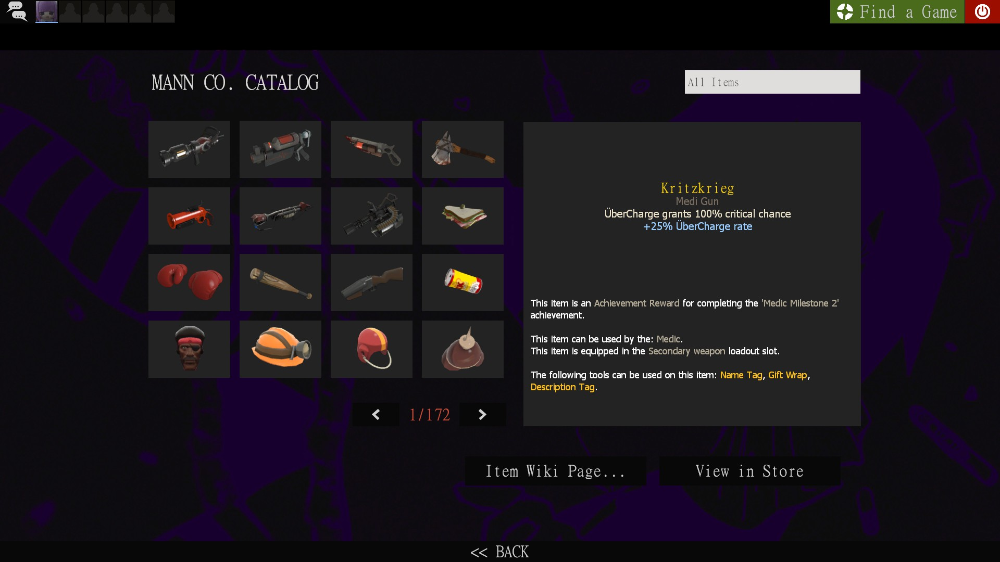

  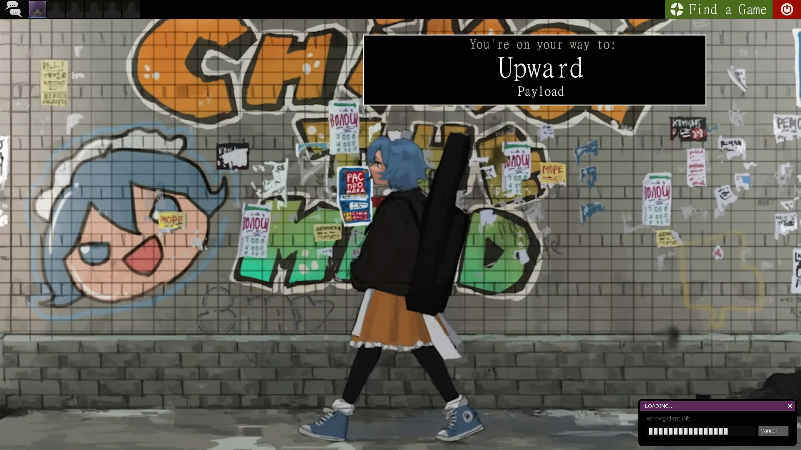

  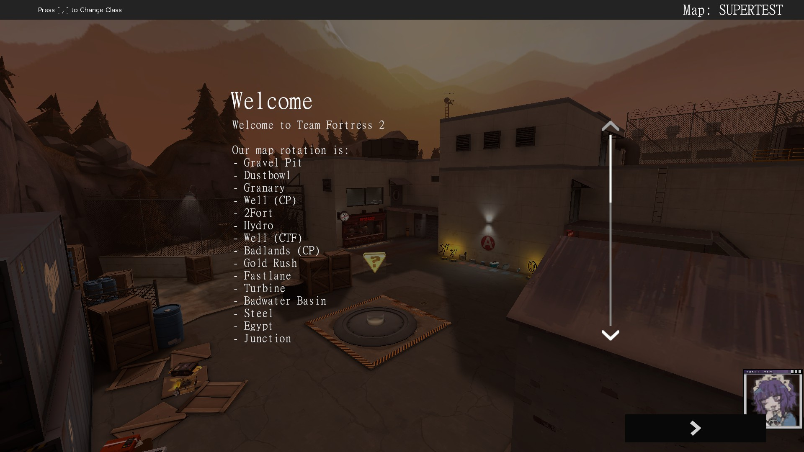

  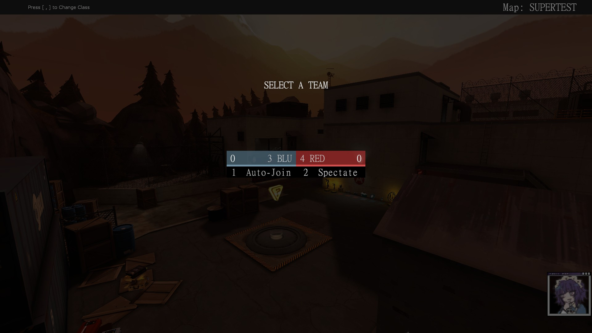

  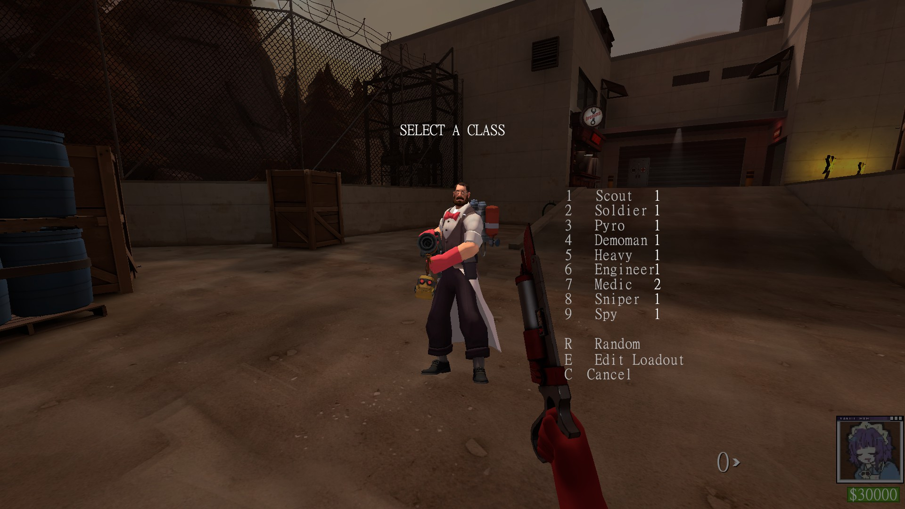

  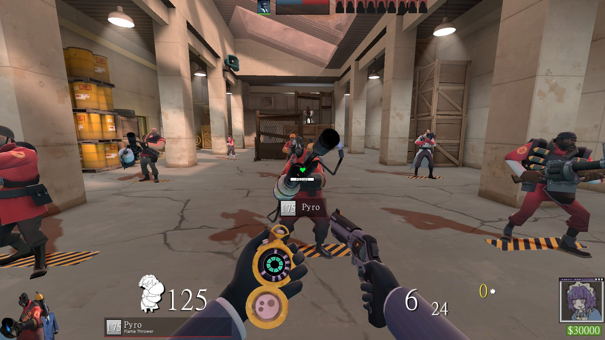

  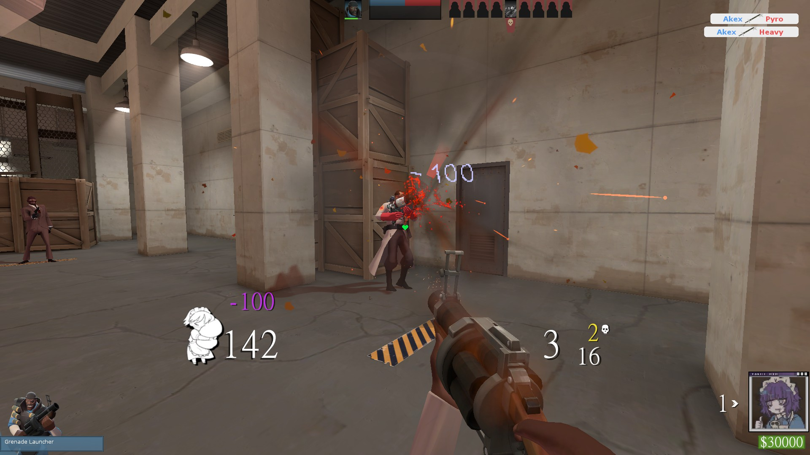

  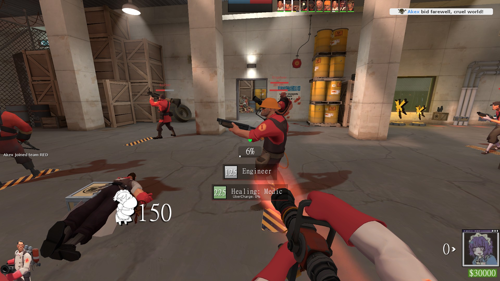

  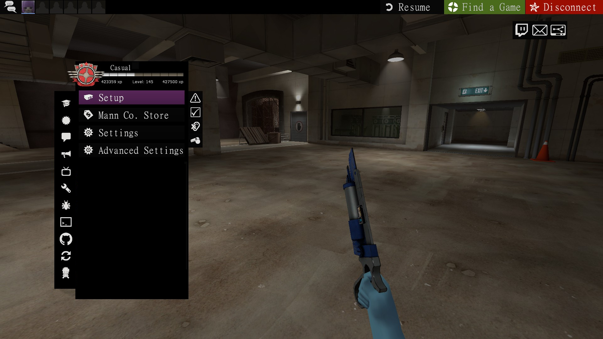

