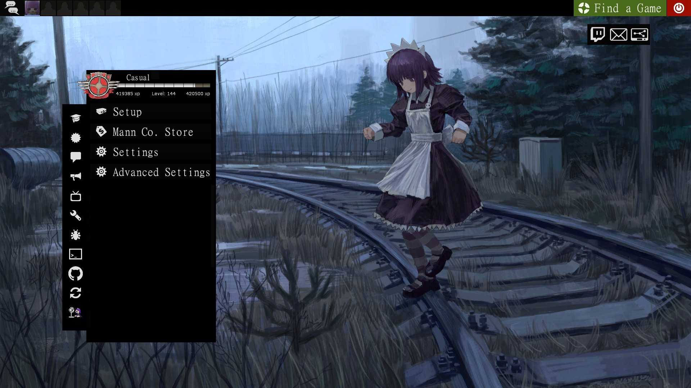
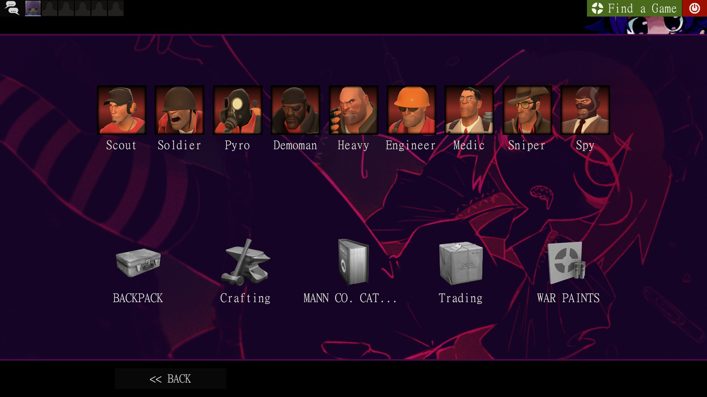

## IMPORTANT TO READ!!

This hud needs 2 Fonts to be installed on your system to properly work

  [Gamefont (Damage Numbers)](https://files.catbox.moe/cxknym.ttf)
  
  [MingLiU-ExtB (Whole UI)](https://files.catbox.moe/is6y9d.ttf)

## DO NOT USE MINIMAL HUD, IT BREAKS MOST THINGS

# AKEX HUD

 A weird and purple maidcore HUD that I made for me, but am making public.

 This HUD is a forked and heavily edited version of ToonHUD; I liked the base, but I didn't like the actual basic HUD.
 
 (Is still in BETA)

  

## HUD

> It comes with a custom menu music (yes, just one song placed a lot of times, but you can change it)

> Custom images for different menus

> Fully edited main HUD

> Gameplay mascot (Love it, based of Niko reactions)

> Weird shit

> Example text

> I dunno what else to add

> Just try it to see what it has

  

  

## Installation

Just download the repo and add it on tf/custom

## ADDONS

Yes! this HUD has a few ADDONS that I made for it

Install them with this [Casual Preloader](https://gamebanana.com/tools/19049)

  [Paper Mario Crits (Someone made this in gamebanana already, but added more things to it, like mini crit and updated the crit particle)](https://drive.google.com/file/d/14JCULTlA0ANvjRzbESd7e5aNIVucFZ3d/view?usp=sharing)
  
  [Yakui Medic Callout](https://drive.google.com/file/d/1M-qv2SLwZjygDf2bdLrgBXM_VmgxRPPs/view?usp=sharing)

  [Class Select Music (Mutes also other sounds in the same menu, and was taken from gamebanana)](https://drive.google.com/file/d/1Q1iG5Uz1_wyuMgjepPfqOlFql8g55Gkd/view?usp=sharing)

  ## Art

  The original artwork of the gameplay mascot was made by [Kimispice](https://x.com/kimispice/status/2021289963237568746), had to draw (yes, draw) more sprites for it to work, but credits to'em for creating the original one

  The menu background was made by [An_Yb](https://www.pixiv.net/en/artworks/142351663)

  The Backpack/Loadout background are edited versions from [Pelcman's artwork](https://pelcman.honifuwa.com/post/613474535371669504/20200324-its-time-to-take-your-happiness-back)

  The loading screen screen, is literally just a screenshot taken from the video of the 2025 [Chikoi Album](https://www.youtube.com/watch?v=KH89fk-0qks)

  The chibi Chikoi health icon was made by [Hinemosu Notari](https://danbooru.donmai.us/posts/394495?q=chikoi_%28nijiura_maids%29+)

   
