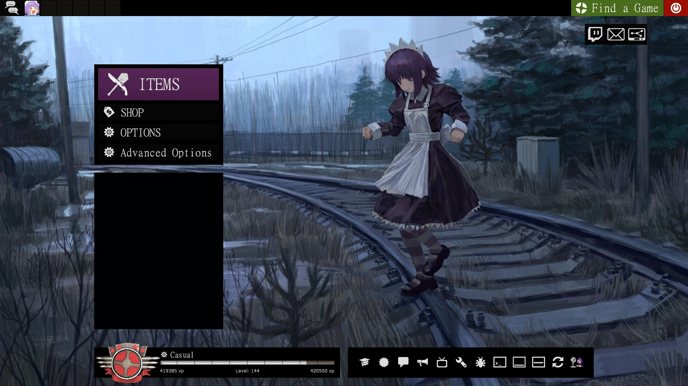
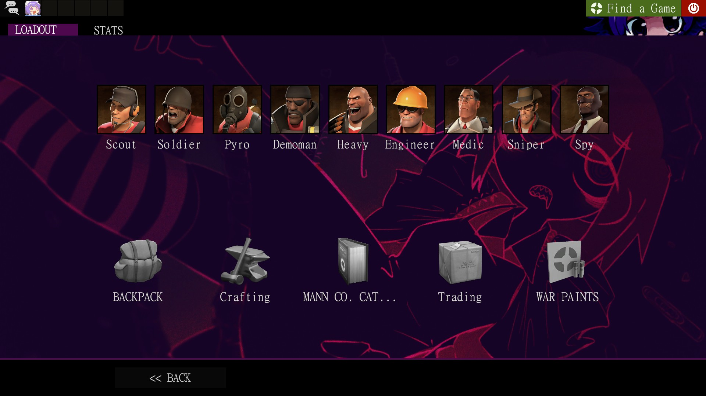
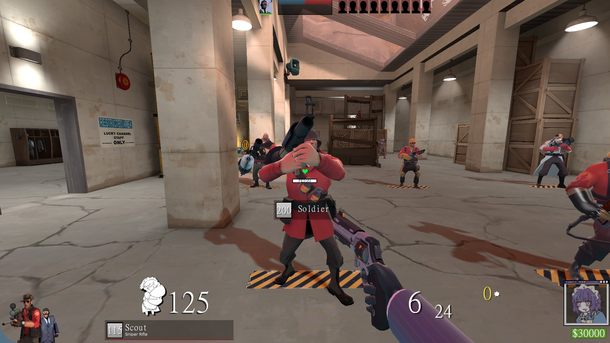

## IMPORTANT TO READ!!

# AKEX HUD

 A weird and purple maidcore HUD made for me, but that am making public.

 This HUD is a forked and heavily edited version of ToonHUD; I liked the base, but I didn't like the actual basic HUD.
 (Is still in BETA)

  

## HUD

> It comes with a custom menu music (yes, just one song placed a lot of times, but you can change it)

> Custom images for different menus

> Fully edited main HUD

> Gameplay mascot (Love it)

> Weird shit

> Example text

> I dunno what else to add

> Just try it to see what it has

  

  

## Installation

Just download the repo and add it on tf/custom

This hud needs 2 Fonts to be installed on your system to properly work

  [Gamefont (Damage Numbers)](https://files.catbox.moe/cxknym.ttf)
  
  [MingLiU-ExtB (Whole UI)](https://files.catbox.moe/is6y9d.ttf)

## ADDONS

Yes! this HUD has a few ADDONS that I made for it
Install them with this [Casual Preloader](https://gamebanana.com/tools/19049)

  [Paper Mario Crits](https://drive.google.com/file/d/14JCULTlA0ANvjRzbESd7e5aNIVucFZ3d/view?usp=sharing)
  
  [Yakui Medic Callout](https://drive.google.com/file/d/1M-qv2SLwZjygDf2bdLrgBXM_VmgxRPPs/view?usp=sharing)

  [Class Select Music (Mutes also other sounds in the same menu)](https://drive.google.com/file/d/1Q1iG5Uz1_wyuMgjepPfqOlFql8g55Gkd/view?usp=sharing)

